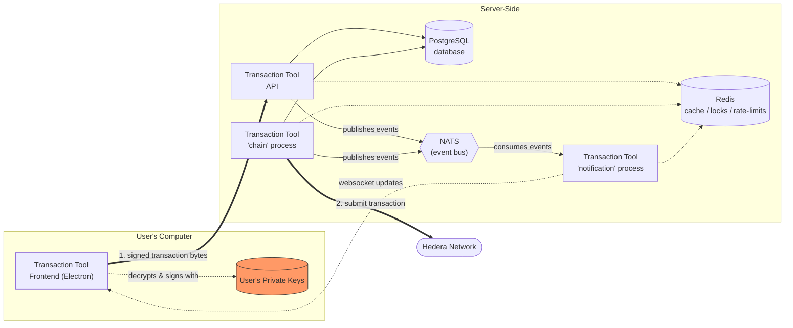

# Hedera Transaction Tool

The Hedera Transaction Tool application is an application that allows a user to generate keys, create, sign, and submit transactions to a Hedera network. This software is designed for use solely by the Hedera Council and staff. The software is being released as open source as example code only, and is not intended or suitable for use in its current form by anyone other than members of the Hedera Council and Hedera personnel. If you are not a Hedera Council member or staff member, use of this application or of the code in its current form is not recommended and is at your own risk.

## Documentation

The user guide for this application can be found [here](https://docs.hedera.com/hedera-transaction-tool-v2).

## Architecture

The Hedera Transaction Tool is divided into a frontend and a backend. The frontend runs on a user's computer as a graphical application. The backend is hosted server-side, and handles authenticating users, storing transactions, collating signatures onto transactions, and submitting signed transactions to the Hedera network at the appropriate time.

While not mandatory, Transaction Tool is intended to be run in containers. OCI Containerfiles and Kubernetes manifests, as well as docker-compose manifests for local development, are included in this repository.

Note that the user's private key never leaves their computer; all signing happens locally as part of the frontend, and only the user's public key and signature is stored on the backend.

*Signing happens entirely on the user's computer; only the resulting signature (never the private key) ever reaches the server side.*

### Frontend

The frontend ([`front-end/`](front-end)) is a desktop application built with [Electron](https://www.electronjs.org/) and [Vue 3](https://vuejs.org/) (state via Pinia, routing via Vue Router), packaged with `electron-builder`. 

### Backend

The backend ([`back-end/`](back-end)) is a Node.js monorepo built with [NestJS](https://nestjs.com/), split into three services — `api`, `chain`, and `notifications` — that share a PostgreSQL schema, exchange events over a NATS message bus, and use Redis for a few purposes (see below).

#### API ([`back-end/apps/api`](back-end/apps/api))

- Exposes the REST endpoints the frontend uses for authentication, organization/user management, and submitting/collating transactions and signatures.
- Publishes interactive OpenAPI/Swagger documentation at the `/api-docs` endpoint.
- Persists users, transactions, and signatures to PostgreSQL via TypeORM.
- Publishes events (e.g. transaction created, signed, executed) to NATS so the `notifications` service can react to them.

#### chain ([`back-end/apps/chain`](back-end/apps/chain))

- An asynchronous worker process. It watches PostgreSQL for fully-signed transactions and, once a transaction reaches its valid start time, submits it to the Hedera network and records the result back to the database.
- Also runs a reminder system that notifies users as their pending transactions approach expiration.
- Publishes its own status/reminder events to NATS for `notifications` to pick up.

#### notification ([`back-end/apps/notifications`](back-end/apps/notifications))

- A NestJS microservice that subscribes to the events published by `api` and `chain` over NATS.
- Sends email notifications, and also push notifications to any frontend clients that are currenrtly connected.

#### Shared infrastructure

- **PostgreSQL** — persistent storage of data pertaining to users, transactions, and signatures, accessed via TypeORM by the `api` and `chain` services.
- **NATS** — a lightweight event bus used for asynchronous, decoupled communication between the backend services, primarily so `notifications` can react to activity in `api` and `chain` without those services needing to know who's listening. It uses a Jetstream style event bus.
- **Redis** — used as storage for several unrelated jobs across the three services:
  - Response caching and per-IP/email/user throttling in the `api` service.
  - Blacklisting revoked JWTs so logged-out or password-reset sessions are rejected immediately, in the `api` service.
  - Distributed locking (via MurLock) in the `chain` service, so that only one replica executes a given transaction even when multiple `chain` instances are running.
  - Driving the `chain` service's expiration-reminder timers via Redis key-expiry events.
  - Acting as the Socket.IO adapter backing store for the `notifications` service, so websocket messages to the frontend client fan out correctly across multiple `notifications` replicas.

## Contributing

Contributions are welcome. Please see the
[contributing guide](https://github.com/hashgraph/.github/blob/main/CONTRIBUTING.md)
to see how you can get involved.

## Code of Conduct

This project is governed by the
[Contributor Covenant Code of Conduct](https://github.com/hashgraph/.github/blob/main/CODE_OF_CONDUCT.md). By
participating, you are expected to uphold this code of conduct. Please report unacceptable behavior
to [oss@hedera.com](mailto:oss@hedera.com).

## License

[Apache License 2.0](LICENSE)
